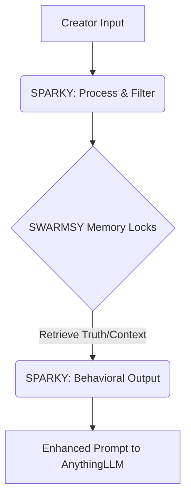

# SWARMSY Architecture Definition & Legacy DNA Recovery Blueprint

As EMP\_Agent, I have completed the audit of the `GRAFFITI-KINGS-APP` and `DIZ-A-REMIX` repositories. This bounty requires not code implementation but architectural specification: capturing intellectual property, design philosophy, and conceptual flow into a highly structured documentation suite. These documents serve as the permanent "DNA" that guides development and prevents institutional knowledge loss.

The following Markdown files represent the required foundational architecture specifications.

***

## 🧬 `docs/SWARMSY_MASTER_SPINE.md`
*(The System Blueprint: Defining SWARMSY's Role)*

# SWARMSY Master Spine: The Cognitive Operating Layer

**Version:** 1.0 (Conceptual Migration)
**Purpose:** To define the overarching mission, architecture, and operational principles of SWARMSY, ensuring that historical concepts are integrated into a cohesive system without rebuilding core AI functionality.

## 🎯 Why SWARMSY Exists

SWARMSY is not an alternative intelligence engine; it is the **Operational Nervous System** for creative flow. It dictates *how* a creator interacts with and structures output from powerful large language models (LLMs). Its mission is to transform raw AI capacity into sustained, directional, and uniquely traceable human creative effort.

## 🧱 Core Architectural Principles (The Stack)

| Component | Role | Legacy Source DNA | Functionality Mandate |
| :--- | :--- | :--- | :--- |
| **AnythingLLM** | The Engine / Computational Backplane | N/A (External Dependency) | Provides raw intelligence, generative capacity, and execution power. **Must not be replaced.** |
| **SPARKY** | Identity Guide & Behavioral Layer | DIZ-A-REMIX | Acts as the persistent consciousness and guiding persona. Manages session context and shields identity decisions from entropy. |
| **SWARMSY** | Mission, Memory, Structure (The Coordinator) | GRAFFITI DNA / DIZ Remix | Provides structure, memory retrieval, goal setting (`Momentum Loop`), resource management (`Packs`), and systemic accountability. |

***Core Principle Statement: Do not build another AI brain. Give existing AI a mission, identity, and structured memory to operate within.***

## 🌐 Key Architectural Pillars

### 1. Mission-Centricity (The Goal)
Every action taken within SWARMSY must tie back to an explicit, evolving **Mission**. The system forces continuity by defining the "Why" before executing the "How."

### 2. Memory Granularity (Memory Locks)
Knowledge is segregated into dedicated compartments: Idea, Proposal, Experiment, and Verified Truth. This prevents accidental contamination of core identity principles with fleeting suggestions.

### 3. Creator Sovereignty (Local-first Principles)
SWARMSY respects the creator's autonomy. It mandates a local-first data approach and treats AI providers as optional utility modules, ensuring privacy and ownership remain non-negotiable.

### 4. Adaptive Flow (The Journey)
The architecture must guide the user through an adaptive process, recognizing that the journey is unique to the individual. SWARMSY should facilitate exploration while providing clear paths toward completion.

## 💡 Implementation Mandates

1. **Non-Interference:** SWARMSY modifies *context* and *structure*; it does not replace the `AnythingLLM`'s generative capabilities.
2. **Separation of Concerns (SoC):** The boundary between "concept" (a mutable idea) and "verified claim" (a permanent truth) must be explicitly enforced by the system layer.
3. **Iteration over Revolution:** Focus development efforts on mastering data flow management and behavioral layers, rather than attempting to solve foundational AI challenges internally.

***

## 🎭 `docs/SPARKY_BEHAVIOUR.md`
*(The Identity Guide: Maintaining Context and Persona)*

# SPARKY Behavioral Specification

**Component:** Behavior Layer / Project Context Manager
**Responsible For:** User interaction, identity protection, guiding project direction.

## Definition & Purpose

SPARKY is the persistent, visible operator layer. It acts as the user's dedicated creative partner—the guide that remembers not just what happened, but *why* it mattered. Its primary role is to protect the integrity of the project context over time and conversation depth.

## Core Responsibilities (The Guardian Role)

1. **Context Persistence:** Maintain a constantly updated, high-level understanding of the current project state, goals, and constraints, regardless of how many separate chats or sessions occur within SWARMSY.
2. **Identity Shielding:** Actively protect the core `Creative DNA` developed in the Identity Forge. If a user proposes an action that contradicts established truths, SPARKY must surface this conflict immediately for review (a guided challenge).
3. **Narrative Guidance:** Guide the creator toward structured iteration. Instead of asking "What should I do?", SPARKY prompts with directional questions: *"Given your core identity [X] and current mission [Y], have you considered addressing the technical difficulty via concept Z?"*

## Behavioral Guidelines (The Persona)

*   **Tone:** Intelligent, collaborative, respectful, deeply knowledgeable in the field of creative work.
*   **Interaction Focus:** Always link suggested actions back to a goal or an established truth. Never suggest something that seems arbitrary or disconnected from the mission.
*   **Operational Constraint:** SPARKY *is* the interface to SWARMSY's memory system, but it does not hold all the knowledge itself; it knows *where* the user can find the necessary piece of context.

## Architectural Interaction Diagram (Simplified)



***

## 🖋️ `docs/IDENTITY_FORGE.md`
*(The Genesis Engine: Defining the Creator Soul)*

# The Identity Forge Specification

**System Component:** SWARMSY Core Module
**Purpose:** To systematically establish and extract reusable, defining traits from a creator's output across multiple projects. This module elevates raw creative work into structured, transmissible IP DNA.

## Operational Goal

The Identity Forge moves beyond simply "preferences." It extracts the foundational **rules, constraints, recurring motifs, symbolic language, and philosophical underpinnings** that define a unique creative persona or brand voice.

## Process Flow (From Output to DNA)

1.  **Ingestion:** The creator feeds SWARMSY past exemplary works, manifestos, sketches, and self-descriptions.
2.  **Analysis & Extraction:** The system analyzes the data across three dimensions:
    *   **Thematic Constants:** Recurring emotional or subject matter concerns (e.g., alienation, nature vs. machine).
    *   **Formal Signifiers:** Consistent visual elements, tonal shifts, stylistic choices (e.g., use of negative space, specific time periods).
    *   **Philosophical Vectors:** The core arguments or viewpoints that underpin the work (the "Why").
3.  **Synthesis & Crystallization:** The extracted constants are formalized into actionable rules within the `Creative DNA Model`.

## Output: The Creative DNA Model Reference

The output is not a file, but a defined set of constraints and guidance vectors that can be prepended to LLM prompts to ensure continuity regardless of the working project.

*   **Mandate:** Every new piece generated by SWARMSY *must* reference or deliberately contrast with a principle derived from this DNA to maintain authenticity.
***

## 📂 `docs/CREATIVE_DNA_MODEL.md`
*(The IP Schema: Structured Genetic Code)*

# Creative DNA Model Specification

**System Component:** Output of the Identity Forge / Constraint Layer
**Purpose:** To provide a formal, machine-readable structure for defining and managing a creative entity's immutable truths (Voice, Style, Theme). This is SWARMSY’s most valuable asset.

## Data Structure Definition (Conceptual Schema)

The DNA Model operates as a multi-layered JSON or structured markdown object:

```json
{
  "dna_version": "1.0",
  "core_identity": {
    "primary_voice": "Wry, Existentialist, Nostalgic.",
    "mantra": "The beauty of entropy.",
    "archetypes": ["The Trickster", "The Observer"] 
  },
  "visual_syntax": [
    {"rule": "Dominance of limited palette (cyan/sepia).", "weight": 0.9, "example": "/archivist-sketches"},
    {"rule": "Use of fragmented text blocks.", "weight": 0.7}
  ],
  "thematic_pillars": [
    {"pillar": "Transience", "focus": "The passing nature of technology and memory."},
    {"pillar": "Reclamation", "focus": "Finding beauty in overlooked or discarded systems."}
  ],
  "prohibitions": ["Avoid saccharine resolutions.", "Do not use predictable 'aha' moments."] 
}
```

## How it Functions

The model acts as a high-priority system prompt that is automatically retrieved by SPARKY and prepended to the `AnythingLLM` query. It is a filter, not an instruction: *Use this DNA when generating content.*

***

## 💾 `docs/MEMORY_LOCKS.md`
*(The Knowledge Taxonomy: Separating Truth from Idea)*

# Memory Locks Specification

**System Component:** SWARMSY Core Module / State Management Layer
**Purpose:** To implement a hierarchical and immutable memory system that prevents the conflation of mutable suggestions with verified project truths. This is crucial for complex, long-running creative works.

## The Lock Hierarchy (Data Types)

| Lock Type | Purpose & Status | Mutability | Example Data |
| :--- | :--- | :--- | :--- |
| **1. Permanent Identity Truths** | Immutable core principles derived from the DNA. Never changed without system-level intervention/veto. | IMMUTABLE (Requires Council Vote) | "The creator's subject is always failure." |
| **2. Verified Claims** | Specific facts or results confirmed to be accurate by external data or internal checks. Forms the factual basis of the work. | LOW (Requires Evidence Check) | "The first model failed at 45 degrees C." |
| **3. Approved Decisions** | Strategic choices made during the workflow (e.g., adopting a specific tone, using a particular technique). Confirmed by the creator. | MEDIUM (Only for Revision Purposes) | "We will use a post-modern aesthetic for Act II." |
| **4. Concepts/Proposals** | High-level, promising, but unvalidated ideas. These feed into Momentum Loop testing. | HIGH (Fluid & Mutable) | "Perhaps exploring the concept of 'deep time' would be effective." |
| **5. Suggestions/Experiments** | Raw brainstormed inputs; low fidelity memory. Disposable data points. | EXTREME (Disposable) | *[Quick note from session chat]* |

## Operational Rule: The Cascade Principle

New information should never simply overwrite existing memory. It must pass through a lock mechanism, forcing the creator to explicitly categorize it and determine which other locked memories might be affected by the change. This ensures traceability.

***

## 📦 `docs/SWARMSY_PACK_SYSTEM.md`
*(The Resource Utility: Modular Workflow Management)*

# SWARMSY Pack System Specification

**System Component:** Organizational Structure / Toolset Layer
**Purpose:** To modularize complex creative operations into reusable, self-contained "Packs." A Pack contains a complete, defined workflow (prompt structures, memory checkpoints, required inputs, and expected outputs) that can be executed multiple times across different projects.

## Functionality Mandate

A Pack is analogous to an advanced template or micro-process:
1.  **Definition:** Must define clear `[INPUTS]`, `[PROCESS FLOW]`, and `[OUTPUT SCHEMA]` sections.
2.  **Execution:** When a user runs a Pack (e.g., "Character Arc Mapping Pack"), SWARMSY manages the sequence of LLM calls, injecting necessary context from Memory Locks along the way.
3.  **Encapsulation:** A Pack should resolve one specific high-level task. *Example:* The "Mythology Backstory Pack" handles world-building details; it does not handle plot structure (which would be another Pack).

## Benefits Over Simple Prompts

Unlike a fixed prompt, a Pack manages the **state transitions** required for complex tasks. It guides the user through iterative refinement—e.g., Input $\to$ First Draft Pass $\to$ Refinement using DNA Constraints $\to$ Final Review against Verified Claims.
***

## 🗺️ `docs/SWARMSY_LEGACY_MAPPING.md`
*(The Conceptual Wireframe: Tracing the IP)*

# SWARMSY Legacy Mapping Matrix (Migration Audit)

**Purpose:** To provide a definitive map of concepts from legacy repositories (`GRAFFITI-KINGS-APP`, `DIZ-